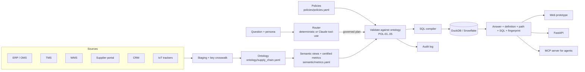

# Throughline — Supply Chain Ontology and Governed Conversational Analytics

**Live prototype:** https://claude.ai/artifact/YAX47z7MU9s57XMNWTi3tw
**GitHub Pages mirror:** https://snbaskarraj.github.io/throughline-supply-chain-ontology/
**Repository:** https://github.com/snbaskarraj/throughline-supply-chain-ontology

Supply chain data is scattered across ERP, TMS, WMS, supplier portals, CRM and IoT trackers, each with its own keys and its own definition of the same KPI. Ask "what was on-time delivery last quarter?" and you get 98.3% from the ERP, 91.6% from the TMS and 85.7% from the planning sheet. Throughline fixes that with three layers:

1. **An industry ontology** — Supplier → Part → Plant → Shipment → Order → Customer, with hierarchies (Part → Category, Plant → Region, Carrier → Mode, Day → Month → Quarter, Customer → Segment/Region) and a key crosswalk that resolves every source system's identifier to one entity.
2. **Governed semantic views** — nine certified metrics (on-time delivery, fill rate, days of inventory, landed cost, freight cost, lead time, late deliveries, condition excursions, order lines), each with one definition, an accountable owner, a pinned version, a grain, a time anchor and the dimensions the ontology allows.
3. **Governed conversational analytics** — a natural-language layer that can *only* answer through those metrics. It maps each team's vocabulary to the certified definition, refuses uncertified terms, asks when a word is ambiguous, blocks slices the ontology doesn't support, masks contract prices by persona, and fingerprints every plan so you can prove two answers used identical logic.

The result, shown live in the prototype's **"Same answer, every team"** tab:

| Team | Their words | Resolves to | Plan |
|---|---|---|---|
| Planning | "What was our service level by plant last quarter?" | On-time delivery v2.1 × Plant × Q3 2026 | `fp-e0b39158` |
| Procurement | "Show supplier punctuality per plant for Q3 2026" | On-time delivery v2.1 × Plant × Q3 2026 | `fp-e0b39158` |
| Logistics | "Delivery performance by plant, July to September 2026" | On-time delivery v2.1 × Plant × Q3 2026 | `fp-e0b39158` |

Identical fingerprint, identical SQL, identical numbers — enforced in CI by `tests/test_consistency.py`.

## Architecture



The LLM never writes SQL. It can only fill a JSON schema whose enums are the certified metrics, ontology dimensions and known entity values; the semantic layer validates the plan and compiles the SQL. See [docs/architecture.md](docs/architecture.md).

## What's in the repo

| Path | What it is |
|---|---|
| `ontology/supply_chain.yaml` | Entities, relationships with cardinality, hierarchies, source-key mappings, dimensions |
| `semantic/metrics.yaml` | Certified metric definitions, SQL, owners, versions, allowed dimensions, team vocabulary |
| `semantic/semantic_views.sql` | The same model as Snowflake `CREATE SEMANTIC VIEW` DDL and portable SQL views |
| `policies/policies.yaml` | POL-01 certified only, POL-02 ontology-valid slicing, POL-03 price masking, POL-04 small-sample flag, POL-05 fingerprint + audit |
| `src/throughline/router.py` | Deterministic NL → plan router (synonyms, entities, periods, sort, clarification, refusals) |
| `src/throughline/llm_router.py` | Optional Claude tool-use router, schema-constrained and validated; falls back to deterministic |
| `src/throughline/semantic_layer.py` | Plan validation against the ontology, fingerprinting, SQL compilation |
| `src/throughline/service.py` | Execution on DuckDB, small-sample flags, persona masking, audit |
| `src/throughline/api.py` | FastAPI: `/ask`, `/query`, `/records`, `/metrics`, `/ontology`, `/policies`, `/audit` |
| `src/throughline/mcp_server.py` | MCP tools (`ask`, `query_metric`, `list_metrics`, `describe_ontology`) — no raw-SQL tool by design |
| `src/throughline/data_gen.py` | Seeded synthetic data (760 order lines, 8 suppliers, 16 parts, 4 plants, 7 carriers, 10 customers, inventory snapshot) |
| `web/` | The prototype: `engine.js` (same model in the browser) + `index.src.html`; `build.py` produces `index.html` |
| `.cursor/`, `.vscode/` | Cursor rules, MCP config template, run/debug configurations |
| `scripts/` | `run.sh` / `run.ps1` one-shot setup and run, `export_csv.py` for the Snowflake load, `publish.sh` GitHub publish |
| `tests/` | Persona consistency, governance guards, and browser-vs-DuckDB parity |
| `snowflake/deploy.sql` | Snowflake database, tables, stage, contract-price masking policy, and parity checks |
| `.cortex/skills/throughline-governed-analytics/` | Cortex Code CLI project skill: deploy and answer only through certified metrics |
| `docs/coco-demo-script.md` | Four-minute Cortex Code CLI demo script |

The prototype that GitHub Pages serves is `web/index.html`. It is generated; do not edit it by hand. Change `web/index.src.html` or `web/engine.js`, then run `python web/build.py`.

## How a question is executed

One process serves both the prototype and the API. `scripts/run.sh` starts `uvicorn throughline.api:app` on port 8000 with `PYTHONPATH=src`.

There are two engines over one model:

| Engine | Where it runs | What you open |
|---|---|---|
| Browser prototype | `web/engine.js`, inlined into `web/index.html` | http://localhost:8000 |
| DuckDB service | `src/throughline/service.py` | http://localhost:8000/docs and the JSON endpoints |

`GET /` returns `web/index.html`. That page does not call `/ask`. On load, `engine.js` builds the dataset in the browser with the same seeded Mulberry32 generator as `src/throughline/data_gen.py` (760 order lines from 1 Jan 2026 through 30 Sep 2026, plus a 49-position inventory snapshot as of 30 Sep 2026). Asking a question in the page runs the router, validator, fingerprint, and metric math locally. That is why the GitHub Pages copy works with no Python server.

The API path, used by `curl`, `/docs`, and the MCP server, does this:

1. **Route.** `router.parse` finds entity values first, refuses uncertified terms, maps team vocabulary to one certified metric, then reads dimension, period, sort, and limit. An ambiguous word such as "cost" returns a clarification.
2. **Validate.** The plan is checked against the ontology. The metric must exist and its version must be pinned (POL-01). Every dimension and filter must be reachable from the metric's grain (POL-02).
3. **Fingerprint.** FNV-1a over `{metric, version, dimension, filters, period, sort, limit}`. Persona is not an input, so equal fingerprints prove equal logic across teams.
4. **Compile.** `semantic_layer.compile_sql` is the only SQL writer. It emits SQL from the metric's certified expression and the ontology join path.
5. **Execute and govern.** DuckDB runs the SQL. A group with fewer than five records is flagged (POL-04). Record drill-down masks supplier contract prices for every persona except Procurement (POL-03).
6. **Explain and audit.** The answer carries the definition, owner, version, ontology path, semantic view, compiled SQL, and fingerprint. The request is appended to the in-memory audit log (POL-05).

Without `ANTHROPIC_API_KEY`, routing is deterministic. With a key, `llm_router.py` may fill the same plan schema through Claude. Invalid output falls back to the deterministic router. Neither path is allowed to emit SQL.

`tests/test_parity.py` runs the browser engine in Node and the service on DuckDB over twelve questions and fails if fingerprint, total, or any group value disagrees.

## Run it end to end

One model, three surfaces. The local app needs only Python. Snowflake and Cortex Code CLI are the warehouse path and need an account.

| Surface | Start | What you open |
|---|---|---|
| Web prototype and REST API | `./scripts/run.sh` | http://localhost:8000 and http://localhost:8000/docs |
| MCP server | `make mcp` | Cursor or Claude, tools `ask`, `query_metric`, `list_metrics`, `describe_ontology` |
| Snowflake | `python scripts/export_csv.py`, then `snowflake/deploy.sql` | Database `THROUGHLINE`, schema `SUPPLY_CHAIN` |

Steps 1–10 below are the local app, which is what the tests and the GitHub Pages prototype cover. The warehouse steps are [Run it on Snowflake](#run-it-on-snowflake). Both paths use the same seed: 760 order lines, Q3 on-time delivery 85.84%, Chennai lowest at 81.63%.

### Prerequisites

- Python 3.10 or newer. Check with `python3 --version`. On a machine whose `python3` is 3.9, install Python 3.12 and start with `PYTHON=python3.12 ./scripts/run.sh`. After `.venv` exists, later runs use the interpreter inside it.
- A terminal. macOS and Linux use `scripts/run.sh`. Windows PowerShell uses `scripts\run.ps1`.
- Node.js is not required to serve the UI. It is required only for the browser-versus-DuckDB parity test. CI uses Node 20. If `node` is missing, that one test is skipped.
- Optional: `jq` to pretty-print API JSON, Docker to run the container, and an `ANTHROPIC_API_KEY` if you want Claude to route questions.

### 1. Open the repo

```bash
cd /path/to/throughline-supply-chain-ontology
```

In Cursor: **File → Open Folder** and select this directory.

### 2. Free port 8000 if a previous run is still holding it

Ctrl+C stops the server. Ctrl+Z only suspends it, and the suspended process still owns port 8000. The next start then fails with `ERROR: [Errno 48] Address already in use` after the tests have already passed.

If the job is suspended:

```bash
kill %1
```

If something else is listening:

```bash
lsof -nP -iTCP:8000 -sTCP:LISTEN
kill <PID>
```

### 3. Create the environment, test, and start

macOS or Linux, one command. Leave this terminal open.

```bash
./scripts/run.sh
```

That script:

1. Creates `.venv` when it is missing (`PYTHON` overrides the interpreter; default is `python3`).
2. Activates it.
3. Runs `pip install -r requirements.txt` (DuckDB, PyYAML, FastAPI, Uvicorn, pytest, httpx, MCP, Anthropic).
4. Runs `python -m pytest -q`. Expect `13 passed`.
5. Prints the URLs and starts `PYTHONPATH=src uvicorn throughline.api:app --reload --port 8000`.

Windows PowerShell:

```powershell
.\scripts\run.ps1
```

The same steps by hand:

```bash
python3.12 -m venv .venv
source .venv/bin/activate          # Windows: .venv\Scripts\Activate.ps1
pip install -r requirements.txt
python -m pytest -q
PYTHONPATH=src uvicorn throughline.api:app --reload --port 8000
```

Makefile equivalents, after the virtual environment is active:

```bash
make test      # python -m pytest -q
make serve     # UI at http://localhost:8000 and API docs at /docs
make web       # rebuild web/index.html from index.src.html + engine.js
make mcp       # stdio MCP server
make docker    # docker build -t throughline . && docker run -p 8000:8000 throughline
```

In Cursor's **Run and Debug** panel you can also pick **Run Throughline API + UI** or **Run tests**. If Cursor asks for an interpreter, choose `.venv`.

A healthy start looks like this:

```text
.............                                                            [100%]
13 passed in 2.04s
Open http://localhost:8000  (API docs: http://localhost:8000/docs)
INFO:     Uvicorn running on http://127.0.0.1:8000 (Press CTRL+C to quit)
INFO:     Application startup complete.
```

### 4. Open the prototype and read the data

In a browser, open http://localhost:8000. API docs are at http://localhost:8000/docs. Health is `GET /health` and returns `{"ok": true}`.

You land on the **Ask** tab as **Planning**. The header switch **Asking as** is Planning, Procurement, or Logistics. It changes vocabulary and whether supplier prices are visible. It does not change the metric result, and it is not part of the plan fingerprint.

The sidebar box **Data in this prototype** states the dataset: 760 synthetic order lines (1 Jan–30 Sep 2026) across 8 suppliers, 16 parts, 4 plants, 7 carriers and 10 customers, plus a 49-position inventory snapshot. The seed is fixed, so every visitor sees the same numbers.

Click **What was our service level by plant last quarter?**

The route bar lights **Plant → Shipment → Order**. The answer is on-time delivery v2.1 for Q3 2026 (1 Jul 2026–30 Sep 2026, by order date):

| Plant | On-time delivery |
|---|---|
| Monterrey | 87.3% |
| Rotterdam | 87.1% |
| Pune | 86.5% |
| Chennai | 81.6% |
| Overall | 85.8% |

The bar axis starts at 70% so the gaps stay visible. The API returns the unrounded total `85.84` and group values `87.27`, `87.14`, `86.54`, `81.63`. The page rounds those for display.

On that answer card:

1. Open **How this was answered**. It shows the matched phrase ("service level" → On-time delivery v2.1), the definition, the owner (Head of Logistics Excellence, certified 14 Jul 2026), the slice (Plant), the period, the ontology path, semantic view `sc_fulfilment`, policy checks POL-01 through POL-05, the compiled SQL, and plan fingerprint **`fp-e0b39158`**.
2. Click **Show records**. You get the order lines behind the number: order, part, supplier, plant, customer, carrier, promised date, delivered date, quantities, and unit price. The card shows 8 of the matching rows. As Planning or Logistics the unit price is masked. Switch **Asking as** to **Procurement** and open **Show records** again. The same rows show the contract price. The 85.8% does not change.

The suggestion chips also exercise the guards:

- `What is OTIF by plant?` — refused. OTIF is not a certified metric. The reply offers the certified alternatives.
- `What's the cost by carrier?` — clarification. The word "cost" can mean landed cost or freight cost.
- `Days of inventory by customer` — blocked by POL-02. Inventory has no path to Customer in the ontology.

The other tabs are filled from the same seed:

| Tab | What you see |
|---|---|
| **Same answer, every team** | Planning, Procurement, and Logistics each ask in their own words. All three cards show `fp-e0b39158` and the same numbers. Under that, the raw ERP, TMS, WMS, and planning-sheet answers disagree. |
| **Ontology** | Click Supplier, Part, Plant, Shipment, Order, or Customer. The side panel lists attributes, hierarchy, relationships, and the source-system keys mapped onto that entity (ERP `LIFNR`, supplier-portal `vendor_code`, TMS shipper name, and so on). |
| **Metric catalog** | The nine certified metrics: definition, owner, version, grain, and the dimensions the ontology allows. |
| **Governance** | POL-01 through POL-05, lineage from source systems to the selected metric, and the audit log of questions asked in this browser session. Refreshing the page clears the browser log. The server log is separate, at `GET /audit`. |
| **Why this exists** | Four different source-system answers to the same questions, then **One supplier, four identities**: the crosswalk from each source key to one `supplier_id`. |

### 5. Call the API from a second terminal

Health:

```bash
curl -s http://localhost:8000/health
```

The question whose fingerprint is pinned in CI and in the table at the top of this file:

```bash
curl -s http://localhost:8000/ask \
  -H 'content-type: application/json' \
  -d '{"question":"Supplier punctuality per plant for Q3 2026","persona":"procurement"}'
```

With `jq`, the fields to compare against the prototype:

```bash
curl -s http://localhost:8000/ask \
  -H 'content-type: application/json' \
  -d '{"question":"Supplier punctuality per plant for Q3 2026","persona":"procurement"}' \
  | jq '.fingerprint, .total, .groups'
```

Expected:

```text
"fp-e0b39158"
85.84
[
  { "key": "Monterrey", "value": 87.27, "n": ..., "low_confidence": false },
  { "key": "Rotterdam", "value": 87.14, "n": ..., "low_confidence": false },
  { "key": "Pune",      "value": 86.54, "n": ..., "low_confidence": false },
  { "key": "Chennai",   "value": 81.63, "n": ..., "low_confidence": false }
]
```

`persona` must be `planning`, `procurement`, or `logistics`. The same three wordings used by those teams all return `fp-e0b39158`:

```bash
curl -s http://localhost:8000/ask -H 'content-type: application/json' \
  -d '{"question":"What was our service level by plant last quarter?","persona":"planning"}' \
  | jq .fingerprint

curl -s http://localhost:8000/ask -H 'content-type: application/json' \
  -d '{"question":"Delivery performance by plant, July to September 2026","persona":"logistics"}' \
  | jq .fingerprint
```

Catalog and governance documents:

```bash
curl -s http://localhost:8000/metrics
curl -s http://localhost:8000/ontology
curl -s http://localhost:8000/policies
curl -s http://localhost:8000/audit
```

`/audit` lists questions asked through the API in this server process. Questions asked only in the browser are not in that list, because the page computes them locally.

A structured plan, for agents that already know the metric id:

```bash
curl -s http://localhost:8000/query \
  -H 'content-type: application/json' \
  -d '{"metric":"otd","dimension":"plant","period_from":"2026-07-01","period_to":"2026-09-30","persona":"planning"}'
```

Row-level drill-down. `unit_cost` is masked unless `persona` is `procurement`:

```bash
curl -s http://localhost:8000/records \
  -H 'content-type: application/json' \
  -d '{"metric":"otd","dimension":"plant","period_from":"2026-07-01","period_to":"2026-09-30","persona":"procurement"}'
```

Certified metric ids for `/query` and `/records`: `otd`, `fill_rate`, `doi`, `landed_cost`, `freight_cost`, `lead_time`, `late_count`, `excursion`, `order_lines`.

### 6. Optional Claude routing and MCP

Copy the example env file and set a key only if you want Claude to fill the plan. The validator still runs, and the model still cannot write SQL.

```bash
cp .env.example .env
```

```text
ANTHROPIC_API_KEY=...
THROUGHLINE_MODEL=claude-sonnet-5-5
```

Restart the server after changing `.env`. Uvicorn does not load `.env` by itself; export the variables in the shell before `./scripts/run.sh`, or prefix the process:

```bash
set -a && source .env && set +a
./scripts/run.sh
```

To expose the same layer to Cursor, copy the MCP template and restart Cursor:

```bash
cp .cursor/mcp.example.json .cursor/mcp.json
```

`.cursor/mcp.json` is gitignored. The server command is `python -m throughline.mcp_server` with `PYTHONPATH` pointing at `src`. Tools are `ask`, `query_metric`, `list_metrics`, and `describe_ontology`. There is no raw-SQL tool. Then ask Cursor: "use throughline to get on-time delivery by plant for Q3".

The same stdio server, from an activated virtual environment:

```bash
make mcp
```

Claude Desktop / Claude Code config:

```json
{
  "mcpServers": {
    "throughline": {
      "command": "python",
      "args": ["-m", "throughline.mcp_server"],
      "env": { "PYTHONPATH": "src" }
    }
  }
}
```

### 7. Rebuild the prototype after a model change

`web/index.html` is the file the server and GitHub Pages actually serve. CI fails if it is stale relative to its sources.

```bash
python web/build.py
python -m pytest -q
```

If you change a metric, dimension, or synonym, change both the YAML (`ontology/supply_chain.yaml`, `semantic/metrics.yaml`, `policies/policies.yaml`) and `web/engine.js`. `tests/test_parity.py` fails when the browser and DuckDB disagree.

### 8. Run the tests on their own

```bash
source .venv/bin/activate
python -m pytest -q
```

The suite is persona consistency (`tests/test_consistency.py`), governance refusals and masking (`tests/test_governance.py`), and browser-versus-DuckDB parity (`tests/test_parity.py`).

### 9. Docker

```bash
docker build -t throughline .
docker run --rm -p 8000:8000 throughline
```

The image is Python 3.12. The container listens on `0.0.0.0:8000` and serves the same UI and API. Open http://localhost:8000.

### 10. Stop the server

In the terminal where Uvicorn is running, press Ctrl+C. Do not use Ctrl+Z. A suspended job keeps port 8000 busy, and the next `./scripts/run.sh` will pass the tests and then exit with `Address already in use`.

## Run it on Snowflake

This loads the same seeded dataset into Snowflake, builds the semantic views, and answers through Cortex Code CLI. The project skill is `.cortex/skills/throughline-governed-analytics/SKILL.md`. The recording script is [docs/coco-demo-script.md](docs/coco-demo-script.md).

### Prerequisites

- A Snowflake account, and a connection in `~/.snowflake/connections.toml`. The demo uses the name `hack`.
- Cortex Code CLI. On macOS or Linux:

```bash
curl -LsS https://ai.snowflake.com/static/cc-scripts/install.sh | sh
cortex --version
```

The `cortex` binary lands in `~/.local/bin`. The first `cortex` opens a setup wizard and writes the connection. Start later sessions with `cortex -c hack` from the repo root.

- The Python virtual environment from `./scripts/run.sh`, so `scripts/export_csv.py` can import the data generator.

### 1. Export the CSVs

From the repo root:

```bash
source .venv/bin/activate
python scripts/export_csv.py
```

That writes seven files under `snowflake/data/`. The directory is gitignored. A local check of those files returns 760 order lines, freight `31113.67`, and Q3 on-time delivery `85.84`.

### 2. Create the database, then load the stage

`snowflake/deploy.sql` creates `THROUGHLINE.SUPPLY_CHAIN`, the dimension and fact tables, the `csv_hdr` file format, and stage `@sc_stage`. The `COPY` statements read `@sc_stage/<table>.csv.gz`, so the files have to be on the stage before those statements run. The `PUT` in the file is a comment for that reason.

In Cortex Code, from the repo root:

```text
cortex -c hack
```

```text
Deploy Throughline to Snowflake. Run python scripts/export_csv.py if snowflake/data is empty. Create the database, schema, tables, file format, and stage from snowflake/deploy.sql, PUT file://snowflake/data/*.csv to @sc_stage with AUTO_COMPRESS=TRUE, then run the COPY statements, the masking policy, and the parity checks.
```

By hand, with Snowflake CLI (`snow`) or SnowSQL, connected as a role that can create a database:

```sql
-- statements through CREATE OR REPLACE STAGE sc_stage in snowflake/deploy.sql
PUT file://snowflake/data/*.csv @THROUGHLINE.SUPPLY_CHAIN.sc_stage AUTO_COMPRESS=TRUE;
-- then the COPY statements, masking policy, and parity checks in snowflake/deploy.sql
```

Run the `PUT` from the repo root so `file://snowflake/data/` resolves. The parity queries at the bottom of `snowflake/deploy.sql` must return:

| Check | Value |
|---|---|
| `order_lines` | 760 |
| `freight` | 31113.67 |
| `otd_q3` | 85.84 |

`mask_contract_price` is applied to `v_part_contract_price.contract_price`. `SC_PROCUREMENT` sees the price. `SC_PLANNING` and `SC_LOGISTICS` see NULL. The roles are created by the deploy script. Grant them usage before switching into one:

```sql
GRANT USAGE ON DATABASE THROUGHLINE TO ROLE SC_LOGISTICS;
GRANT USAGE ON SCHEMA THROUGHLINE.SUPPLY_CHAIN TO ROLE SC_LOGISTICS;
GRANT SELECT ON VIEW THROUGHLINE.SUPPLY_CHAIN.v_part_contract_price TO ROLE SC_LOGISTICS;
-- repeat for SC_PROCUREMENT, and GRANT SELECT ON ALL TABLES IN SCHEMA so that role can read the facts
```

### 3. Create the semantic views

`semantic/semantic_views.sql` has two parts.

- **Part 1** is Snowflake `CREATE SEMANTIC VIEW` for `sc_fulfilment` and `sc_inventory`.
- **Part 2** is the DuckDB reference the local app uses (`INTERVAL 90 DAY`, and a plain `VIEW` also named `sc_fulfilment`). Run Part 2 only against DuckDB. On Snowflake it would replace the semantic view.

`sc_inventory` reads `v_cogs_90d`, and Part 2's definition of that view is DuckDB syntax. On Snowflake, create the view with Snowflake dates, then create `sc_inventory`:

```sql
USE SCHEMA THROUGHLINE.SUPPLY_CHAIN;

-- Part 1, sc_fulfilment only (the first CREATE OR REPLACE SEMANTIC VIEW in semantic/semantic_views.sql)

CREATE OR REPLACE VIEW v_cogs_90d AS
SELECT o.plant_id, o.part_id, SUM(s.qty_shipped * pt.unit_cost) AS cogs_90d
FROM fct_shipment s
JOIN fct_order_line o ON o.order_id = s.order_id
JOIN dim_part pt ON pt.part_id = o.part_id
WHERE s.ship_date > DATEADD(day, -90, DATE '2026-09-30')
  AND s.ship_date <= DATE '2026-09-30'
GROUP BY 1, 2;

-- Part 1, sc_inventory (the second CREATE OR REPLACE SEMANTIC VIEW)
```

In Cortex Code, after the load:

```text
Create and validate semantic view sc_fulfilment from Part 1 of semantic/semantic_views.sql. Then create v_cogs_90d with DATEADD, then create semantic view sc_inventory. Do not run Part 2 on Snowflake.
```

If the semantic-view syntax differs on the account, the bundled `semantic-view` skill should correct Part 1. Commit that fix so the next run matches the file.

### 4. Ask through the certified metrics

Stay in `cortex -c hack`. The project skill maps team language onto `semantic/metrics.yaml` and refuses anything else.

```text
/skill list
```

You should see `throughline-governed-analytics` (this repo), plus the bundled `semantic-view` and `cortex-agent` skills.

```text
What was our service level by plant last quarter?
```

Expected: "service level" resolves to on-time delivery v2.1, path Plant → Shipment → Order, SQL against `sc_fulfilment`, overall **85.8%**, Chennai lowest at **81.6%**.

```text
Show supplier punctuality per plant for Q3 2026.
```

Same plan and the same numbers. Then the guards:

```text
What is OTIF by plant?
```

Refused. OTIF is not certified. The reply offers on-time delivery and fill rate.

```text
Days of inventory by customer
```

Blocked. Days of inventory has no ontology path to Customer (POL-02).

Optional, as `SC_LOGISTICS`:

```sql
SELECT * FROM THROUGHLINE.SUPPLY_CHAIN.v_part_contract_price;
```

`contract_price` is NULL. The same query as `SC_PROCUREMENT` returns the unit cost.

To leave a Cortex Agent on the semantic view:

```text
Create a Cortex Agent over sc_fulfilment for supply chain questions.
```

Ask it one certified question and confirm it returns the same 85.8%.

## Publish the repo and the prototype

The prototype committed in this repo is `web/index.html`, built from `web/index.src.html` and `web/engine.js`. Pushing `main` runs `.github/workflows/pages.yml`, which rebuilds that file and deploys it to GitHub Pages. `.github/workflows/ci.yml` runs the tests and fails the build if `web/index.html` was not regenerated.

With the GitHub CLI, logged in once:

```bash
gh auth login
./scripts/publish.sh
```

`scripts/publish.sh` creates `github.com/<you>/throughline-supply-chain-ontology`, pushes `main`, and turns on Pages with GitHub Actions as the source. The prototype is then at `https://<you>.github.io/throughline-supply-chain-ontology/`. The first deploy takes about a minute.

By hand, on an empty GitHub repo with the README, license, and `.gitignore` boxes left unticked:

```bash
git remote add origin https://github.com/snbaskarraj/throughline-supply-chain-ontology.git
git push -u origin main
```

In the repo settings, set Pages to **GitHub Actions**. If the GitHub repo name is different, change the two links at the top of this file.

## Judging focus

**Real-world relevance.** The disagreement is real and expensive: OTD, fill rate, landed cost and days of inventory are the metrics S&OP, procurement and logistics argue about every month. The prototype reproduces the exact failure modes — ship-date vs delivery-date OTD, line vs unit fill, landed cost with and without freight and duty, unit- vs value-based inventory cover — and the cross-system key mismatch underneath them.

**Technical execution.** One semantic model, two engines: the browser and the Python/DuckDB service share the seeded data generator, metric definitions and fingerprint function, and a CI test fails if they ever disagree. Plans are validated against the ontology before any SQL exists; the LLM path is schema-constrained and can't emit SQL.

**Solution completeness.** Ontology → semantic views → certified metrics → NL layer → governance (refusal, clarification, ontology guards, masking, small-sample flags, audit, lineage) → four delivery channels (web, REST, MCP, Cortex Code CLI on Snowflake) → tests and CI/CD to GitHub Pages.

## Production path

The Snowflake load, semantic views, masking policy, and Cortex Code CLI skill are in [Run it on Snowflake](#run-it-on-snowflake). From there: load the ontology into a catalog (Unity Catalog / Horizon / Collibra) so metric ownership and lineage are discoverable; replace synthetic data with CDC feeds from ERP/TMS/WMS; route ambiguous or high-stakes questions to a human steward; add metric-change review in pull requests (a definition change bumps the version and changes every fingerprint that depends on it).

---
Built by Baskarraj S N · +91-9703801932 · snbaskar@gmail.com · [Portfolio](https://snbaskarraj.github.io/snbaskarraj.io/) · [GitHub](https://github.com/snbaskarraj)
