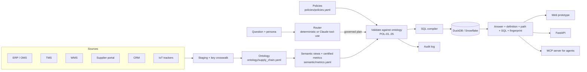

# Throughline — Supply Chain Ontology and Governed Conversational Analytics

**Live prototype:** https://claude.ai/artifact/YAX47z7MU9s57XMNWTi3tw
**GitHub Pages mirror:** https://snbaskarraj.github.io/throughline-supply-chain-ontology/
**Repository:** https://github.com/snbaskarraj/throughline-supply-chain-ontology

Supply chain data is scattered across ERP, TMS, WMS, supplier portals, CRM and IoT trackers, each with its own keys and its own definition of the same KPI. Ask "what was on-time delivery last quarter?" and you get 98.3% from the ERP, 91.6% from the TMS and 85.7% from the planning sheet. Throughline fixes that with three layers:

1. **An industry ontology** — Supplier → Part → Plant → Shipment → Order → Customer, with hierarchies (Part → Category, Plant → Region, Carrier → Mode, Day → Month → Quarter, Customer → Segment/Region) and a key crosswalk that resolves every source system's identifier to one entity.
2. **Governed semantic views** — nine certified metrics (on-time delivery, fill rate, days of inventory, landed cost, freight cost, lead time, late deliveries, condition excursions, order lines), each with one definition, an accountable owner, a pinned version, a grain, a time anchor and the dimensions the ontology allows.
3. **Governed conversational analytics** — a natural-language layer that can *only* answer through those metrics. It maps each team's vocabulary to the certified definition, refuses uncertified terms, asks when a word is ambiguous, blocks slices the ontology doesn't support, masks contract prices by persona, and fingerprints every plan so you can prove two answers used identical logic.

The result, shown live in the prototype's **"Same answer, every team"** tab:

| Team | Their words | Resolves to | Plan |
|---|---|---|---|
| Planning | "What was our service level by plant last quarter?" | On-time delivery v2.1 × Plant × Q3 2026 | `fp-e0b39158` |
| Procurement | "Show supplier punctuality per plant for Q3 2026" | On-time delivery v2.1 × Plant × Q3 2026 | `fp-e0b39158` |
| Logistics | "Delivery performance by plant, July to September 2026" | On-time delivery v2.1 × Plant × Q3 2026 | `fp-e0b39158` |

Identical fingerprint, identical SQL, identical numbers — enforced in CI by `tests/test_consistency.py`.

## Architecture



The LLM never writes SQL. It can only fill a JSON schema whose enums are the certified metrics, ontology dimensions and known entity values; the semantic layer validates the plan and compiles the SQL. See [docs/architecture.md](docs/architecture.md).

## What's in the repo

| Path | What it is |
|---|---|
| `ontology/supply_chain.yaml` | Entities, relationships with cardinality, hierarchies, source-key mappings, dimensions |
| `semantic/metrics.yaml` | Certified metric definitions, SQL, owners, versions, allowed dimensions, team vocabulary |
| `semantic/semantic_views.sql` | The same model as Snowflake `CREATE SEMANTIC VIEW` DDL and portable SQL views |
| `policies/policies.yaml` | POL-01 certified only, POL-02 ontology-valid slicing, POL-03 price masking, POL-04 small-sample flag, POL-05 fingerprint + audit |
| `src/throughline/router.py` | Deterministic NL → plan router (synonyms, entities, periods, sort, clarification, refusals) |
| `src/throughline/llm_router.py` | Optional Claude tool-use router, schema-constrained and validated; falls back to deterministic |
| `src/throughline/semantic_layer.py` | Plan validation against the ontology, fingerprinting, SQL compilation |
| `src/throughline/service.py` | Execution on DuckDB, small-sample flags, persona masking, audit |
| `src/throughline/api.py` | FastAPI: `/ask`, `/query`, `/records`, `/metrics`, `/ontology`, `/policies`, `/audit` |
| `src/throughline/mcp_server.py` | MCP tools (`ask`, `query_metric`, `list_metrics`, `describe_ontology`) — no raw-SQL tool by design |
| `src/throughline/data_gen.py` | Seeded synthetic data (760 order lines, 8 suppliers, 16 parts, 4 plants, 7 carriers, 10 customers, inventory snapshot) |
| `web/` | The prototype: `engine.js` (same model in the browser) + `index.src.html`; `build.py` produces `index.html` |
| `.cursor/`, `.vscode/` | Cursor rules, MCP config template, run/debug configurations |
| `scripts/` | `run.sh` / `run.ps1` one-shot setup and run, `publish.sh` GitHub publish |
| `tests/` | Persona consistency, governance guards, and browser-vs-DuckDB parity |

## Run it in Cursor

1. **File → Open Folder** and select this repo.
2. In the terminal: `./scripts/run.sh` (macOS/Linux/Git Bash) or `.\scripts\run.ps1` (Windows PowerShell). It creates `.venv`, installs dependencies, runs the 13 tests and starts the app at http://localhost:8000.
3. Or use the **Run and Debug** panel: *Run Throughline API + UI* or *Run tests* (select `.venv` as the interpreter when Cursor asks).
4. Optional MCP: copy `.cursor/mcp.example.json` to `.cursor/mcp.json`, then ask Cursor's agent “use throughline to get on-time delivery by plant for Q3”.

## Run it manually

```bash
python -m venv .venv && source .venv/bin/activate
pip install -r requirements.txt
make test                       # 13 tests: consistency, governance, parity
make serve                      # http://localhost:8000  (UI)  and /docs (API)
```

Ask the API:

```bash
curl -s localhost:8000/ask -H 'content-type: application/json' \
  -d '{"question":"Supplier punctuality per plant for Q3 2026","persona":"procurement"}' | jq '.fingerprint, .total, .groups'
```

Use it from Claude Desktop / Claude Code / Cursor as an MCP server:

```json
{ "mcpServers": { "throughline": { "command": "python", "args": ["-m", "throughline.mcp_server"], "env": { "PYTHONPATH": "src" } } } }
```

Optional LLM routing: set `ANTHROPIC_API_KEY` (and `THROUGHLINE_MODEL` if you want a different model). Without a key everything runs deterministically.

## Try these in the prototype

- Switch persona and ask the same thing in different words — compare the plan fingerprints.
- "What is OTIF by plant?" — refused: not certified yet, with the certified alternatives offered.
- "What's the cost by carrier?" — asks whether you mean landed cost or freight cost.
- "Days of inventory by customer" — blocked: inventory has no path to Customer in the ontology.
- Open **Show records** as Logistics, then as Procurement — supplier prices are masked for everyone but Procurement, while the metric values stay identical.
- **Why this exists** tab — every source system's answer to the same four questions, and one supplier's four different keys.

## Judging focus

**Real-world relevance.** The disagreement is real and expensive: OTD, fill rate, landed cost and days of inventory are the metrics S&OP, procurement and logistics argue about every month. The prototype reproduces the exact failure modes — ship-date vs delivery-date OTD, line vs unit fill, landed cost with and without freight and duty, unit- vs value-based inventory cover — and the cross-system key mismatch underneath them.

**Technical execution.** One semantic model, two engines: the browser and the Python/DuckDB service share the seeded data generator, metric definitions and fingerprint function, and a CI test fails if they ever disagree. Plans are validated against the ontology before any SQL exists; the LLM path is schema-constrained and can't emit SQL.

**Solution completeness.** Ontology → semantic views → certified metrics → NL layer → governance (refusal, clarification, ontology guards, masking, small-sample flags, audit, lineage) → three delivery channels (web, REST, MCP) → tests and CI/CD to GitHub Pages.

## Production path

Swap DuckDB for Snowflake (`semantic/semantic_views.sql` is ready) or Databricks; load the ontology into a catalog (Unity Catalog / Horizon / Collibra) so metric ownership and lineage are discoverable; replace synthetic data with CDC feeds from ERP/TMS/WMS; route ambiguous or high-stakes questions to a human steward; add metric-change review in pull requests (a definition change bumps the version and changes every fingerprint that depends on it).

---
Built by Baskarraj S N · +91-9703801932 · snbaskar@gmail.com · [Portfolio](https://snbaskarraj.github.io/snbaskarraj.io/) · [GitHub](https://github.com/snbaskarraj)
